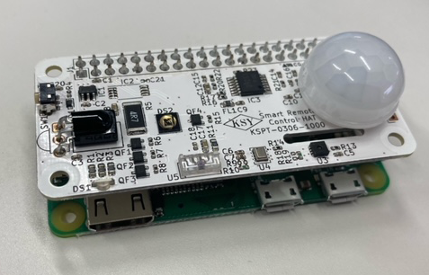
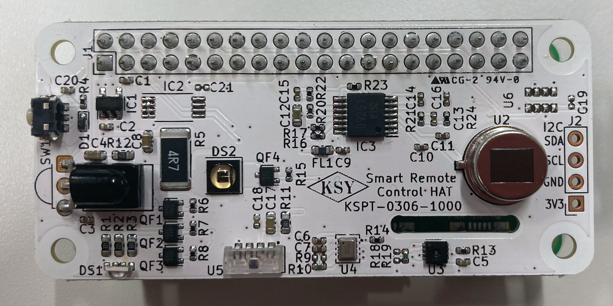

# KSY スマートリモコン HAT   
KSY Smart Remote Control HAT for Raspberry Pi   

---
## 概要

   

スマートホーム向けのスマートリモコンHATです。
各種センサ、赤外線リモコン機能を持ち、オリジナルスマートリモコンを簡単に開発できます。
ミニHATサイズですので、Raspberry Pi Zero W/WH, Raspberry Pi Zero 2 Wと組み合わせるとコンパクトな構成になります。
40Pin GPIOを持つRaspberry Pi 2/3/4と組み合わせることもできます。

---
## ハードウェア
  
### 温湿度センサ U3  
 Sensirion SHT30-DIS-B2.5KS   
I2Cデジタル温湿度センサーです。
温度精度0.2°C、相対湿度精度2%RHです。工場出荷時に調整済みですので簡単に使用できます。
I2Cアドレスは0x44です。  

[SHT30-DIS-B](https://sensirion.com/jp/products/product-catalog/SHT30-DIS-B/ "SHT30-DIS-B")

### 絶対圧センサ U4  
 オムロン 2SMPB-02E  
高精度・低消費電流の小型MEMS絶対圧センサです。I2C接続です。
温度センサも内蔵しています。   
I2Cアドレスは0x70です。

[2SMPB-02E](https://omronfs.omron.com/ja_JP/ecb/products/pdf/CDSC-011A.pdf "2SMPB-02E")

### 焦電センサ U2   
 村田 IRA-S210ST01   
ロームの焦電センサ向けアンプ BD9251FV-E2と組み合わせて人感センサを構成してあります。
デジタル出力で検出できるので取り扱いが簡単になっています。検出距離や検出パターンはフレネルレンズである程度変更できます。   
付属のフレネルレンズはSenba Sensing TechnologyのS9013です。

GPIO9にBD9251FVのT_OUT（移動方向検出出力）、GPIO10にBD9251FVのD_OUT(コンパレータ出力)が接続されています。

[焦電センサ IRA-S210ST01](https://www.murata.com/ja-jp/products/productdetail?partno=IRA-S210ST01 "IRA-S210ST01")   
[焦電型赤外線センサ用アンプ IC BD9251FV-E2](./datasheet/bd9251fv-j.pdf "BD9251FV-E2")   
[Fresnel Lens S9013](https://www.senbasensor.com/products/motion-detect-module-plastic-fresnel-lens-s9003.html "Fresnel Lens S9013")   

### 環境光センサ U5
 VISHAY VEML7700-TT   
0～120,000 lx のI2C環境光センサです。   

I2Cアドレスは0x10です。

[VEML7700](https://www.vishay.com/optical-sensors/list/product-84286/ "VEML7700")

### 赤外リモコン受光モジュール U1
 VISHAY TSOP38238    

キャリア周波数38kHzの赤外リモコン受光モジュールです。学習リモコン機能等に使用できます。
GPIO4に接続されています。

[TSOP38238](https://www.vishay.com/ir-receiver-modules/list/product-82491/ "TSOP38238")

### パワー赤外発光ダイオード DS2
 OSRAM SFH 4726AS A01

半値角75度(150度)、IF=1A時224mW/sr～280mW/srの広角ハイパワー赤外LEDです。
GPIO11に接続されています。駆動はFETにて行っています。
最大電流は1.5Aですが、Raspberry Pi Zeroシリーズでの使用を考慮し駆動電流は抵抗にて約500mAに制限しています。

[SFH 4726AS A01](https://dammedia.osram.info/media/resource/hires/osram-dam-5710828/SFH%204726AS%20A01_EN.pdf "SFH 4726AS A01")

### フルカラーLED DS1
Everlight EASV3015RGBA0   
アノードコモンのフルカラーLED（RGB LED）です。   
RED GPIO27, GREEN GPIO17, BLUE GPIO15 にFET経由で接続されています。

[EASV3015RGBA0](https://everlightamericas.com/pcb/1336/easv3015rgba0.html "EASV3015RGBA0 ")

### タクトスイッチ SW1
 Alps/Alpine SKRTLAE010
サイドプッシュタイプのタクトスイッチです。GPIO14に接続されています。

[SKRTLAE010](https://tech.alpsalpine.com/prod/j/html/tact/surfacemount/skrt/skrtlae010.html "SKRTLAE010")

### 使用GPIO
| GPIO | 機能 | I/O |   
|:-------|:-------|:-------|
|GPIO4 | Ir RX | In |
|GPIO9 | T_OUT Moving detection output| In |
|GPIO10 | D_OUT Comparator output| In |  
|GPIO11 | Ir Tx | Out |
|GOIO14 | SW | In |
|GPIO27 | Red LED | Out |
|GPIO17 | Green LED| Out |
|GPIO15 | Blue LED | Out |

### センサ追加用I2Cコネクタ J2
I2Cのセンサを追加するためのコネクタです。コネクタは未実装ですのでユーザーでにて適当なコネクタを使用してください。

### センサ使用上の注意

各センサは基板上に直接実装しているためRaspberry Pi本体の発熱の影響を受けます。
特にRaspberryPi 4Bではセンサの直下に発熱するチップ（CPU,メモリ、USBコントローラー等）があるためユーザにて断熱等の処理を行ってください

### 回路図

[Schematics pdf](./schematics/smartRemoHAT.pdf "Schematics pdf")

## サンプルソフトウェア

### 各センサ

### 赤外線リモコン

---

## ライセンス
このライブラリはMITライセンスで配布します。 MITライセンスの詳細はLICENSEを参照ください。

[MIT](./LICENSE "LICENCE")

## Author
  
[KSY Co., Ltd.](https://github.com/KSY-IC)

