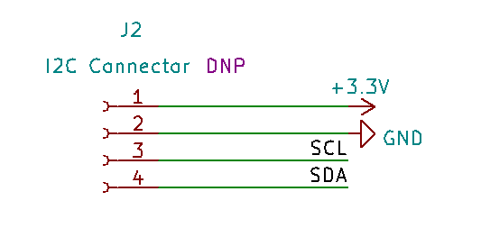

# KSY スマートリモコン HAT   
KSY Smart Remote Control HAT for Raspberry Pi   


---
## 概要

   


スマートホーム向けのスマートリモコンHATです。
各種センサ、赤外線リモコン機能を持ち、オリジナルスマートリモコンを簡単に開発できます。
また環境センサ、見守り装置などにも応用ができます。
ミニHATサイズですので、Raspberry Pi Zero W/WH、 Raspberry Pi Zero 2 Wと組み合わせるとコンパクトな構成になります。
40Pin GPIOを持つRaspberry Pi 2/3/4と組み合わせることもできます。

---
## ハードウェア
  


---
### 温湿度センサ U3  

 Sensirion SHT30-DIS-B2.5KS   
I2Cデジタル温湿度センサーです。
温度精度0.2°C、相対湿度精度2%RHです。工場出荷時に調整済みですので簡単に使用できます。
I2Cアドレスは0x44です。  


[SHT30-DIS-B メーカーホームページ](https://sensirion.com/jp/products/product-catalog/SHT30-DIS-B/)

---
### 絶対圧センサ U4  
 オムロン 2SMPB-02E  
高精度・低消費電流の小型MEMS絶対圧センサです。I2C接続です。
温度センサも内蔵しています。   
I2Cアドレスは0x70です。


[2SMPB-02E データーシート](https://omronfs.omron.com/ja_JP/ecb/products/pdf/CDSC-011A.pdf)


---
### 焦電センサ U2   
 村田 IRA-S210ST01   
ロームの焦電センサ向けアンプ BD9251FV-E2と組み合わせて人感センサを構成してあります。
デジタル出力で検出できるので取り扱いが簡単になっています。検出距離や検出パターンはフレネルレンズである程度変更できます。   
付属のフレネルレンズはSenba Sensing TechnologyのS9013です。

GPIO9にBD9251FVのT_OUT（移動方向検出出力）、GPIO10にBD9251FVのD_OUT(コンパレータ出力)が接続されています。


[焦電センサ IRA-S210ST01 メーカーホームページ](https://www.murata.com/ja-jp/products/productdetail?partno=IRA-S210ST01 "IRA-S210ST01")   
[焦電型赤外線センサ用アンプ IC BD9251FV-E2 データシート](./datasheet/bd9251fv-j.pdf "BD9251FV-E2")   
[Fresnel Lens S9013 メーカーホームページ](https://www.senbasensor.com/products/motion-detect-module-plastic-fresnel-lens-s9003.html "Fresnel Lens S9013")   

---
### 環境光センサ U5
 VISHAY VEML7700-TT   
0～120,000 lx のI2C環境光センサです。   

I2Cアドレスは0x10です。


[VEML7700 メーカーホームページ](https://www.vishay.com/optical-sensors/list/product-84286/)

---
### 赤外リモコン受光モジュール U1
 VISHAY TSOP38238    

キャリア周波数38kHzの赤外リモコン受光モジュールです。学習リモコン機能等に使用できます。
GPIO4に接続されています。


[TSOP38238 メーカーホームページ](https://www.vishay.com/ir-receiver-modules/list/product-82491/)


---
### パワー赤外発光ダイオード DS2
 OSRAM SFH 4726AS A01

半値角75度(150度)、IF=1A時224mW/sr～280mW/srの広角ハイパワー赤外LEDです。
GPIO11に接続されています。駆動はFETにて行っています。
最大電流は1.5Aですが、Raspberry Pi Zeroシリーズでの使用を考慮し駆動電流は抵抗にて約500mAに制限しています。


[SFH 4726AS A01 データシート](https://dammedia.osram.info/media/resource/hires/osram-dam-5710828/SFH%204726AS%20A01_EN.pdf)

---
### フルカラーLED DS1
Everlight EASV3015RGBA0   
アノードコモンのフルカラーLED（RGB LED）です。   
RED GPIO27, GREEN GPIO17, BLUE GPIO15 にFET経由で接続されています。


[EASV3015RGBA0  メーカーホームページ](https://everlightamericas.com/pcb/1336/easv3015rgba0.html)

---
### タクトスイッチ SW1
 Alps/Alpine SKRTLAE010
サイドプッシュタイプのタクトスイッチです。GPIO14に接続されています。


[SKRTLAE010  メーカーホームページ](https://tech.alpsalpine.com/prod/j/html/tact/surfacemount/skrt/skrtlae010.html)

### 使用GPIO
| GPIO | 機能 | I/O |   
|:-------|:-------|:-------|
|GPIO4 | Ir RX | In |
|GPIO9 | T_OUT Moving detection output| In |
|GPIO10 | D_OUT Comparator output| In |  
|GPIO11 | Ir Tx | Out |
|GOIO14 | SW | In |
|GPIO27 | Red LED | Out |
|GPIO17 | Green LED| Out |
|GPIO15 | Blue LED | Out |

### センサ追加用I2Cコネクタ J2
I2Cのセンサを追加するためのコネクタです。コネクタは未実装ですのでユーザーでにて適当なコネクタ（2.54mmピッチ4ピン）を使用してください。



### センサ使用上の注意

各センサは基板上に直接実装しているためRaspberry Pi本体の発熱の影響を受けます。
特にRaspberryPi 4Bではセンサの直下に発熱するチップ（CPU,メモリ、USBコントローラー等）があるためユーザにて断熱等の処理を行ってください

### 回路図
   

[Schematics pdf](./schematics/smartRemoHAT.pdf "Schematics pdf")

---

## サンプルソフトウェア   

Python3.7を使用したテストコードです。

### 各センサのテスト

```smart_remo_hat.py```   
Python3.7を使用したセンサデータ確認用コードです。   
約1秒毎にセンサデータをコンソール出力します。   
人感センサを検出すると赤色LEDが点灯します。   
スイッチを押すと青色LEDが点灯します。   
<BR>

 

<BR>
<BR>
<BR>
<BR>
<BR>

### 赤外線リモコン機能のテスト

pigpioのライブラリを利用し、赤外線リモコンの学習、送信テストを行います。

* pigpioのインストール   
Raspberry Pi OSのバージョンによっては予めインストールされています。
```
$ sudo apt update
$ sudo apt upgrade
$ sudo apt install pigpio python3-pigpio
```

* irrpy.pyのダウンロード   
http://abyz.me.uk/rpi/pigpio/examples.html#Python_irrp_py

* pigpioの起動   
```
sudo systemctl start pigpiod   
```
* 赤外線リモコンの受信（学習）   

    * 学習させたいリモコンを準備します。
    * 次のコードを実行します。   

```
python3 irrp.py -r -g4 -f btn_data b0 b1 b2 
```
    GPIO4に接続された赤外線リモコン受信モジュールよりボタン3つ分btn_dataファイルに取り込みます。
    画面の指示に従い、ボタンを2回ずつ押してデータを取り込みます。

  

受信データの例
```
{"b0": [9004, 4468, 587, 550, 587, 550, 587, 550, 587, 550, 587, 550, 587, 550, 587, 550, 587, 550, 587, 1662, 587, 1662, 587, 1662, 587, 1662, 587, 1662, 587, 1662, 587, 1662, 587, 1662, 587, 550, 587, 550, 587, 550, 587, 1662, 587, 1662, 587, 550, 587, 1662, 587, 550, 587, 1662, 587, 1662, 587, 1662, 587, 550, 587, 550, 587, 1662, 587, 550, 587, 1662, 587],
 "b1": [9004, 4468, 587, 550, 587, 550, 587, 550, 587, 550, 587, 550, 587, 550, 587, 550, 587, 550, 587, 1662, 587, 1662, 587, 1662, 587, 1662, 587, 1662, 587, 1662, 587, 1662, 587, 1662, 587, 1662, 587, 550, 587, 550, 587, 1662, 587, 1662, 587, 550, 587, 1662, 587, 550, 587, 550, 587, 1662, 587, 1662, 587, 550, 587, 550, 587, 1662, 587, 550, 587, 1662, 587],
 "b2": [9004, 4468, 587, 550, 587, 550, 587, 550, 587, 550, 587, 550, 587, 550, 587, 550, 587, 550, 587, 1662, 587, 1662, 587, 1662, 587, 1662, 587, 1662, 587, 1662, 587, 1662, 587, 1662, 587, 1662, 587, 550, 587, 1662, 587, 550, 587, 550, 587, 550, 587, 1662, 587, 550, 587, 550, 587, 1662, 587, 550, 587, 1662, 587, 1662, 587, 1662, 587, 550, 587, 1662, 587]}

```

    ファイル内の数値は赤外線のオン時間とオフ時間が交互に記録されています。   


* 赤外線リモコンの送信（操作）   

```
python3 irrp.py -p -g11 -f btn_data b0
```
    GPIO11に接続された赤外LEDよりbtn_dataファイルのb0コードを送信します。 


---

## ライセンス
このライブラリはMITライセンスで配布します。 MITライセンスの詳細はLICENSEを参照ください。

[MIT](./LICENSE "LICENCE")

## Author
  
[KSY Co., Ltd.](https://github.com/KSY-IC)


